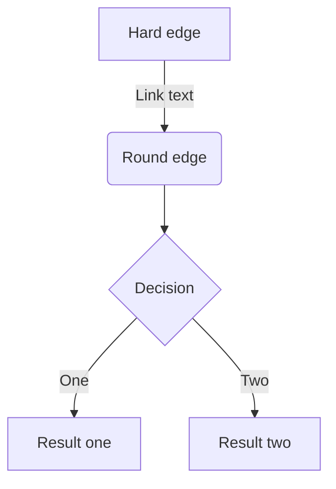

# 見出し
## 見出し2
### 見出し3
#### 見出し4

# リスト

- Hello!
- Hola!
  - Bonjour!
  * Hi!

# 番号付きリスト
1. First
1. Second

# リンク
[ZennのMarkdown記法一覧](https://zenn.dev/zenn/articles/markdown-guide)

# 画像


*C.C.はしっているか*

[](https://pbs.twimg.com/media/D6lyI11UwAARUXm?format=png&name=small)

# テーブル
| Head | Head | Head |
| ---- | ---- | ---- |
| Text | Text | Text |
| Text | Text | Text |

# コードブロック
```js
const great = () => {
  console.log("Awesome");
};
```

```js:fooBar.js
const great = () => {
  console.log("Awesome");
};
```

```diff js
@@ -4,6 +4,5 @@
+    const foo = bar.baz([1, 2, 3]) + 1;
-    let foo = bar.baz([1, 2, 3]);
```


```diff js:fooBar.js
@@ -4,6 +4,5 @@
+    const foo = bar.baz([1, 2, 3]) + 1;
-    let foo = bar.baz([1, 2, 3]);
```

# 数式
$$
e^{i\theta} = \cos\theta + i\sin\theta
$$
インライン：$a=0$

# 引用
うおお
> 引用文
>> 引用文
うおお

# 注釈
脚注の例<span class='has-tooltip relative items-center'><span class='flex tooltip balloon'>脚注の内容その1</span>[^1]</span>です。インライン^[脚注の内容その2]で書くこともできます。脚注[^2]の中に数式も書けます。

[^1]: 脚注の内容その1
[^2]: $\ds\int\dd{x}=x+C$

# 区切り線

---

# インラインスタイル
*イタリック*
**太字**
~~打ち消し線~~
インラインで`code`を挿入する

# Mermaid

<div class="mermaid">
graph LR
    A --- B
    B-->C[あいうえお]
    B-->D(かきくけこ)
</div>
うお

# ツールチップ
文章中で[うおうお]{gueee}というようにツールチップを付けられる。
