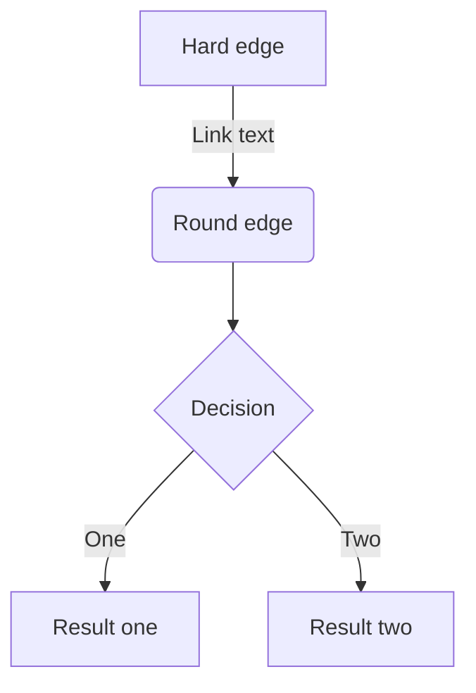
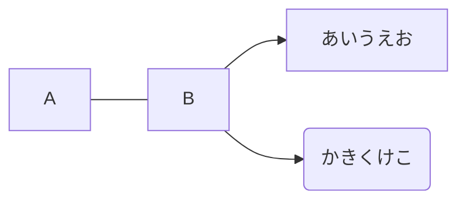
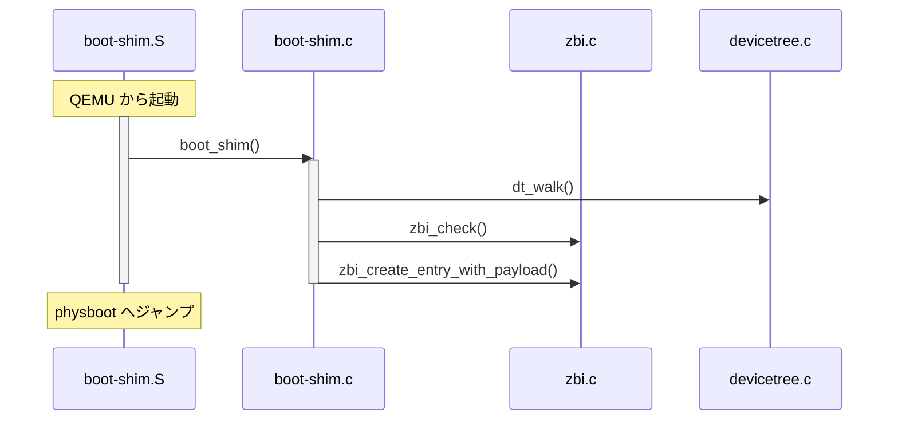

# 見出し
## 見出し2
### 見出し3
#### 見出し4

見出し
=

見出し2
---

# リスト

- Hello!
- Hola!
  - Bonjour!
  * Hi!
    - 3rd
- Red
+ Green
+ Blue

*   Lorem ipsum dolor sit amet, consectetuer adipiscing elit.
    Aliquam hendrerit mi posuere lectus. Vestibulum enim wisi,
    viverra nec, fringilla in, laoreet vitae, risus.
*   Donec sit amet nisl. Aliquam semper ipsum sit amet velit.
    Suspendisse id sem consectetuer libero luctus adipiscing.

1.  This is a list item with two paragraphs. Lorem ipsum dolor
    sit amet, consectetuer adipiscing elit. Aliquam hendrerit
    mi posuere lectus.

    Vestibulum enim wisi, viverra nec, fringilla in, laoreet
    vitae, risus. Donec sit amet nisl. Aliquam semper ipsum
    sit amet velit.

2.  Suspendisse id sem consectetuer libero luctus adipiscing.


1986\. What a great season. ← olキャンセル

# 番号付きリスト
1. First
1. Second
  1. うお

# リンク
[ZennのMarkdown記法一覧](https://zenn.dev/zenn/articles/markdown-guide)

[Markdown文法まとめ](https://qiita.com/higuma/items/3344387e0f2cce7f2cfe "よくまとまっている")

ページ内リンク：[「みんな抱きしめて、銀河の果てまで！」は何がすごいのか](/2022/02/embrace-me/)

ページ内リンク：<a href="/2022/02/embrace-me/">「みんな抱きしめて、銀河の果てまで！」は何がすごいのか</a>


# テーブル
| Head | Head | Head |
| ---- | ---- | ---- |
| Text | Text | Text |
| Text | Text | Text |


| Left align | Right align | Center align |
|:-----------|------------:|:------------:|
| This       | This        | This         |
| column     | column      | column       |
| will       | will        | will         |
| be         | be          | be           |
| left       | right       | center       |
| aligned    | aligned     | aligned      |

# コードブロック

This is a normal paragraph:

    This is a code block.

```js:fooBar.js
const great = () => {
  console.log("Awesome");
};
```

```cpp:main.cpp
#include <iostream>
using namespace std;

int main() {
  cout << "hello world" << endl;
  return 0;
}
```

```diff-javascript[class="diff-highlight"]
@@ -4,6 +4,5 @@
+  const foo = bar.baz([1, 2, 3]) + 1;
-  let foo = bar.baz([1, 2, 3]);
+  const foo = bar.baz([1, 2, 3]) + 1;
-  let foo = bar.baz([1, 2, 3]);
   uouo;
   uouo;
```


```diff js:fooBar.js
@@ -4,6 +4,5 @@
+    const foo = bar.baz([1, 2, 3]) + 1;
-    let foo = bar.baz([1, 2, 3]);
```

```js
   return shell_exec("echo input | markdown_script");
```
```
   return shell_exec("echo input | markdown_script");
```

```latex
\begin{align*}
e^x-e^{-x}
&=\qty(\cancel{1}+x
		+\bcancel{\frac{x^2}{2}}+\frac{x^3}{3!}
		+\xcancel{\frac{x^4}{4!}}+\cdots)
	-\qty(\cancel{1}-x
			+\bcancel{\frac{x^2}{2}}-\frac{x^3}{3!}
			+\xcancel{\frac{x^4}{4!}}+\cdots)\\
&=2\qty(x+\frac{x^3}{3!}+\cdots)\\
&=2i\sin x.
\end{align*}
```

```latex
Campbell-Baker-Hausdorff の公式は，演算子 $\hat{A},\hat{B}$ を用いて次のように書ける：
\begin{equation}
e^{\hat{A}}\hat{B}e^{-\hat{A}}
=\hat{B}+[\hat{A},\hat{B}]+\frac{1}{2}[\hat{A},[\hat{A},\hat{B}]]+\cdots.
\label{eq1}
\end{equation}

式\eqref{eq1}を用いて，演算子 $\hat{V}$ の相互作用表示は次のように書くことができる．
```

`$abc$`, `\eqref{eq:a}`


# 数式
$$
e^{i\theta} = \cos\theta + i\sin\theta\\
=\operatorname{cis}\theta
$$
のように数式を書ける。

\begin{align}
  \eval{\delta(f(x))}_{x\simeq\alpha_i}&=\lim_{\ve\to 0}\dfrac{1}{\sqrt{2\pi\ve}}\exp\qty[-\dfrac{(x-\alpha_i)^2\abs{f'(\alpha_i)}^2}{2\ve}\qty[1+\order{x-\alpha_i}]]\label{eq:a}\\
  &=\lim_{\ve'\to 0}\dfrac{1}{\sqrt{2\pi\ve'}\abs{f'(\alpha_i)}}\exp\qty[-\dfrac{(x-\alpha_i)^2}{2\ve'}\qty[1+\order{x-\alpha_i}]]\ \qty(\ve'=\dfrac{\ve}{\abs{f'(\alpha_i)}^2})\label{eq:b}\\
  &=\dfrac{\delta(x-\alpha_i)}{\abs{f'(\alpha_i)}}\\
  f(x)\delta(x-a)&=f(a)\delta(x-a)\label{eq:delta-convolute}
\end{align}
と式番号も打てるし、\eqref{eq:a}のように参照し、マウスオーバーでプレビューウィンドウも現れる。1つの数式の塊で1つのプレビューウィンドウなので\eqref{eq:b}でも同じウィンドウになる。
\begin{align}
&\theta(p'^0)\delta(p'^\mu p'_\mu-m^2c^2)\dd[4]{p'}\\
&=\theta(\gamma p^0+\gamma\beta p^1)\delta(p^\mu p_\mu-m^2c^2)\dd[4]{p}\\
&=\theta(\gamma p^0+\gamma\beta p^1)\dfrac{c}{2E(\bm{p})}\qty[\delta(p^0-E(\bm{p})/c))+\delta(p^0+E(\bm{p})/c))]\dd[4]{p}\\
&=\dfrac{c}{2E(\bm{p})}[\underbrace{\theta(\gamma E(\bm{p})/c+\gamma\beta p^1)}_{=1\ \because E/c=\sqrt{\bm{p}^2+m^2c^2}>\abs{p^1}}\delta(p^0-E(\bm{p})/c)\notag\\
&\qquad+\underbrace{\theta(-\gamma E(\bm{p})/c+\gamma\beta p^1)}_{=0}\:\underbrace{\delta(p^0+E(\bm{p})/c)}_{=0}]\dd[4]{p}\ (\eqref{eq:delta-convolute}\text{を用いた})\\
&=\dfrac{c}{2E(\bm{p})}\delta(p^0-E(\bm{p})/c)\dd[4]{p}\label{eq:uooo}
\end{align}
\eqref{eq:uooo}を見ればわかるように、ウィンドウ中の式番号をマウスオーバーしても新たなウィンドウは現れない。

インライン：$a=0$のように書ける。
* うおお。$a=0$。
* うおおお$a=0$。

を見比べると、全角文字などで空いているように見える場合は文中数式のスペースは詰められる。また$r$-単体のようにハイフンの前後でもスペースは詰められる。それ以外でスペースを詰めたい場合は$\hspace{-0.2em}a=0$のように手動で詰められる。

- `\mqty()`, `\mqty[]` など：行列が書けます．列は `&` で，行は `\\` で区切ります．
- `\dmat{}`, `\dmat[]{}`：対角行列を出してくれます．`\dmat[0]{a}` のように `0` を渡せば，ゼロで埋めてくれます．

```latex
\[
\mqty[0&1\\2&0],\quad
\mqty[\dmat{1,-1}],\quad
\mqty[\dmat[0]{1,-1}]
\]
```

# 引用
うおお
> 引用文
>> 引用文

うおお

> More is different.
>
>    P. W. Anderson

> ## This is a header.
>
> 1. This is the first list item.
> 2. This is the second list item.
>
> Here's some example code:
> ```
>   return shell_exec("echo $input | $markdown_script");
> ```


# 注釈

脚注の例^[脚注の内容その1。*うおおお*おおおおおおおおおおおおおおおおおおおおおおおおおおおおおおおおおおおおおおおおおおおおおおおおおおおおおおおおおおおうおうおうおうおうおうおうお]です。インライン^[脚注の内容その2]で書くこともできます。脚注^[$\ds\int\dd{x}=x+C$]の中に数式も書けます。別行立て数式^[\begin{align}a\\b\end{align}]も書けます。うおお^[うおお$$\begin{aligned}a\\b\end{aligned}$$ぐえ]

別の書き方[^sink]です

[^sink]: 艱難辛苦に身躯をやつし 真紅の海にSINKしろ！


# 区切り線

---

# インラインスタイル
*イタリック*
**太字**
~~打ち消し線~~
インラインで`code`を挿入する。``files = `ls`.split``とか`` `ps` ``とか。Please don't use any `<blink>` tags.

## チェックボックス
- [ ] タスク1
- [x] タスク2

# Mermaid



うおうお



うお




# ツールチップ
文章中で[うおうお]{gueee}というようにツールチップを付けられる。


# 画像


*C.C.はしっているか*

[](https://pbs.twimg.com/media/D6lyI11UwAARUXm?format=png&name=small)


[](/images/mc-diamond.gif)
<p></img></p>

